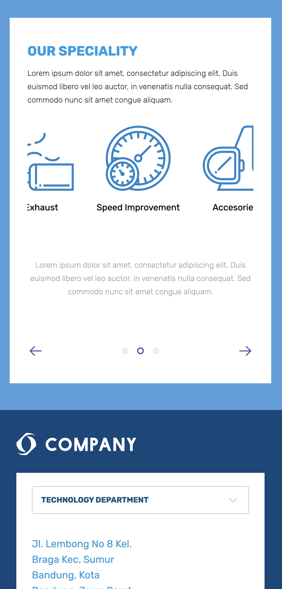

<p align="center">

</p>

<h2 align="center">
Salt Company
</h2>

<pre align="center">
Code Test for Salt Company
</pre>

<p align="center">
<a href="https://salt-company.vercel.app/">🖥 Online Preview</a>
<br>
</p>

## Screenshots

<br><br>
<br><br>
<br><br>


## Setup

``` bash
# Enable pnpm
$ corepack enable

# Install dependencies
$ pnpm install

# Start dev server with hot reload at localhost:3000
$ pnpm dev
```
